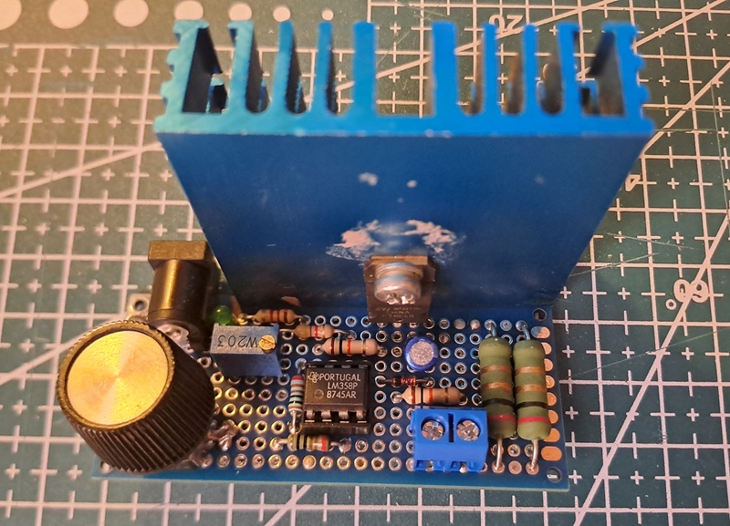
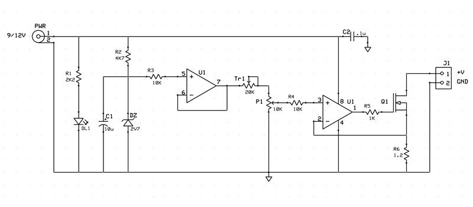
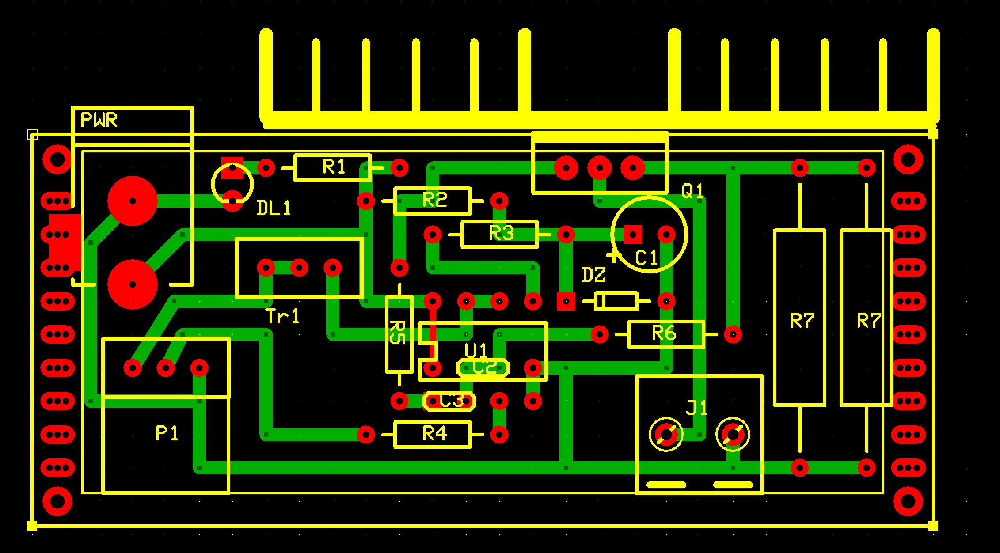

# MOSFET active dummy load for low-power PSU

## Background and Goal
Design and development of a simple **active MOSFET dummy load** to test low-power Power Supply Units (PSUs) with current rating up to $1A$.

## Requirements
- Control Supply ($V_{cc}$): $9\text{V}$ to $15\text{V}$ DC.
- Input Voltage: Up to $30\text{V}$ (depending on MOSFET $V_{ds}$ and thermal dissipation).
- Current Range: $0\text{A}$ to $1\text{A}$ (adjustable).
- Operating Mode: Constant Current (CC).
- Power Dissipation: Safe continuous operation up to $\approx 12\text{--}15\text{W}$ with provided heatsink.
- Control: Fully analog, minimalist design (Op-Amp + MOSFET).

## Design

#### Schematic

#### Circuit Analysis
The circuit operates as a closed-loop current regulator. The Op-Amp ($U1b$) compares the reference voltage from $P1$ with the feedback voltage across the shunt resistor $R7$.

The MOSFET must dissipate a power of $P = (V_{psu} - V_{R7}) \cdot I$. 
At $1\text{A}$ with $R7 = 1.2\Omega$, the formula is $(V_{psu} - 1.2\text{V}) \cdot 1\text{A}$.

The use of a $2.7\text{V}$ Zener diode ($DZ$) and an Op-Amp buffer ($U1a$) ensures a stable reference, decoupling the control logic from supply voltage fluctuations.

*Note*: While $R7$ dissipates a small constant power ($\approx 1.2\text{W}$ @ $1\text{A}$), the MOSFET $Q1$ bears the main thermal stress, which increases linearly with $V_{psu}$.

The MOSFET used is an **STP3NC60** ($600\text{V}$, $3\text{A}$). Its relatively high $R_{ds(on)}$ $(3.3\Omega)$ defines the minimum operating voltage (**Compliance Voltage**) at high currents ($1A$):

$$V_{compliance} \approx I \cdot (R_{ds(on)} + R_7) = 1\text{A} \cdot (3.3\Omega + 1.2\Omega) = 4.5\text{V}$$

This means the load can maintain $1\text{A}$ only if the PSU supply provides at least $4.5\text{V}$.

*Note*: The STP3NC60 was selected due to immediate availability, although it is not optimized for low-voltage linear operation because of its relatively high Rds(on).

**Control Supply($V_{cc}$)**: 
The control logic (Op-Amp) requires a dedicated supply voltage ($V_{cc}$) to drive the MOSFET Gate.
- Recommended $V_{cc}$: $9\text{V}$ to $15\text{V}$ (Standard $12\text{V}$ DC adapter).
- Minimum $V_{cc}$: Approximately $8\text{V}$. This limit is due to the MOSFET's Gate threshold voltage ($V_{gs(th)} \approx 4.5\text{V}$) plus the voltage drop across the shunt resistor ($1.2\text{V}$) and the Op-Amp's internal output swing limitation ($\approx 2\text{V}$ below $V_{cc}$).
- Maximum $V_{cc}$: $30\text{V}$ (Limited by the LM358 and the $2.7\text{V}$ Zener biasing resistor $R2$).

## Implementation and Test
#### PCB Layout
The circuit was assembled on a custom PCB (protoboard $30 \times 70mm$) designed with ExpressPCB.

#### Calibration Procedure
The circuit offers two ways to calibrate the full-scale current ($1A$ target at maximum $P1$ position).

**Method A: Theoretical (Voltage-based)** 
This method assumes $R7$ is exactly $1.2\Omega$.
With $P1$ set to its maximum position, adjust trimmer $Tr1$ until the voltage at pin 3 of $U1$ reaches $1.2V$. This ensures that at full scale, the load draws exactly $1A$ (given $I = V_{ref} / R7$).

**Method B: Empirical (Current-based)** 
Since the shunt resistor $R7$ has a wide tolerance, to calibrate the device:
1. Connect a reliable Ammeter in series with the PSU under test.
2. Set the user potentiometer $P1$ to its maximum position.
3. Adjust trimmer $Tr1$ until the Ammeter reads exactly $1.00A$.

*Note:* During empirical calibration, it was observed that with potentiometer $P1$ at its minimum position, the output current is effectively zero. This confirms that despite the LM358 not being a full rail-to-rail Op-Amp, its ability to swing the output down to the negative rail (GND) is sufficient to fully turn off the MOSFET.

#### Test Log
The circuit was tested using a **GVDA 30V/10A** switching laboratory power supply. Component temperature was measured using a **GVDA GD128** digital multimeter. Tests were conducted in a closed, non-ventilated environment with an ambient temperature of $21^\circ C$.

**Test 1 (Active Load - CC Mode)**:
- Input Voltage: $9.00V$
- Control Supply: $12V$
- Initial State: $1.000A$ @ $21^\circ C (9W)$
- Final State (after 10 min): $0.992A$ @ $71^\circ C$

**Observations**: The circuit demonstrated good stability with a current drift of only $0.8$%, despite a significant thermal increase of $50^\circ C$.

**Test 2 (Minimum Input Voltage)**:
The minimum input voltage (Compliance Voltage) required for the load to maintain the set current is determined by the sum of the voltage drops across the Shunt resistor ($R_7$) and the MOSFET ($Q_1$) in its fully enhanced state ($R_{ds(on)}$).

- Initial Input Voltage: $9.00V$
- Control Supply: $12V$

| Set Current ($I$) | Min. Input Voltage ($V_{min}$) | Calculated $R_{tot}$ ($V/I$) | Calculated $R_{ds} (R_{tot}-R_7)$
| :--- | :--- | :--- | :--- |
| 1.000 A | 5.20 V | 5.20 $\Omega$ | 4.0 $\Omega$
| 0.500 A | 2.15 V | 4.30 $\Omega$ | 3.2 $\Omega$
| 0.250 A | 1.15 V | 4.60 $\Omega$ | 3.4 $\Omega$
| 0.125 A | 0.55 V | 4.40 $\Omega$ | 3.2 $\Omega$

**Observations**: As shown in the table, the $V_{min}$ is not constant but scales linearly with the set current. At the maximum rating of $1A$, the load requires at least $5.2V$ to operate in Constant Current (CC) mode.

**Test 3 (Line Regulation )**:
- Set Current: $0.500A$
- Input Voltage Range: $5.00V$ to $30.00V$

**Observations**: No measurable variation in current was observed across the entire voltage range.

**Test 4 (Control Supply Sensitivity)**:
This test evaluates how fluctuations in the control supply voltage ($V_{cc}$) affect the set current.
- PSU Input Voltage ($V_{in}$): Fixed at $12.00V$.
- Target Current: Calibrated to $200mA$ @ $V_{cc} = 12V$.

| $V_{cc}$ (Control) | Output Current ($I$) | Deviation (%) | Status |
| :--- | :--- | :--- | :--- |
| $5.0 V$ | $0 mA$ | $-100\%$ | **OFF** (Below Gate Threshold) |
| $5.5 V$ | $140 mA$ | $-30.0\%$ | Unstable / Dropout |
| $8.5 V$ | $189 mA$ | $-5.5\%$ | Marginal |
| **$12.0 V$** | **$200 mA$** | **$0.0\%$** | **Calibrated Point** |
| $15.0 V$ | $208 mA$ | $+4.0\%$ | Stable |
| $20.0 V$ | $217 mA$ | $+8.5\%$ | Stable |
| $30.0 V$ | $230 mA$ | $+15.0\%$ | Zener Drift |

**Observations**: The positive correlation between $V_{cc}$ and $I$ is due to the Zener diode ($DZ$) increasing its reference voltage slightly as the bias current through $R2$ increases (Zener Drift).

**Test 5 (Stress Test)**:
This test defines the maximum operating time before thermal saturation.
- Ambient Temperature: $21^\circ C$
- Heatsink Start Temperature: $\approx 30^\circ C$

| Power | Conditions | 1 min | 2 min | 3 min | 4 min |
| :--- | :--- | :--- | :--- | :--- | :--- |
| **15W** | $15V, 1A$ | $39^\circ C$ (.997A) | $56^\circ C$ (.993A) | $67^\circ C$ (.990A) | $76^\circ C$ (.988A) |
| **15W** | $30V, 0.5A$ | $47^\circ C$ (.497A) | $59^\circ C$ (.496A) | $72^\circ C$ (.496A) | $79^\circ C$ (.494A) |
| **20W** | $20V, 1A$ | $49^\circ C$ (.995A) | $65^\circ C$ (.991A) | $83^\circ C$ (.989A) | **$90^\circ C$ (.886A)*** |

*\*Note: At 20W, the system reached thermal runaway/instability after 3.5 minutes.*

Based on the data collected, is possible to estimate the thermal resistance of the heatsink under natural convection conditions ($R_{\theta hs}$). Using the thermal Ohm's law: $R_{\theta hs} = \frac{\Delta T}{P} = \frac{T_{hs} - T_{amb}}{P} = \frac{76^\circ C - 21^\circ C}{15W} \approx \mathbf{3.7 \, K/W}$

**Observations**: Above **15W**, operation must be limited to short bursts (max 2-3 minutes) to avoid MOSFET damage.

## Conclusions
**Results**: The project successfully achieves a stable constant current load using a minimal component count. The test log shows that even with a $50^\circ C$ temperature rise, the current drift remains under $1$%, making it a reliable tool for hobbyist PSU testing.  The heatsink provided is adequate for continuous operation up to **12W-15W**.
  
**Suggestions**: Adding a small fan to increase the power handling capability. This is particularly effective as the heatsink used was originally designed for active cooling (CPU cooler); in natural convection, its dense fin structure tends to trap hot air, while even a minimal airflow would drastically reduce its thermal resistance.

**Evolutions**:
- Experimenting with lower $R_{ds(on)}$ MOSFETs to extend the current regulation range at low PSU voltages (below $5V$).
- Replace $R2$ with a BJT-based constant current source to eliminate the dependency of the set current on Power Supply ($V_{cc}$).
- Thermal protection to reduce current over $85^\circ C$ and avoid damage of the MOSFET.

## About & License
**Author**: Alessandro Fraschetti (gom9000). 
**Technical Notes**: The hardware design was supported by **ExpressPCB** and the custom **[expresspcb-goslib](https://github.com/gom9000/expresspcb-goslib)** libraries. 
**License**: This experience is licensed under the [MIT License](LICENSE). 
