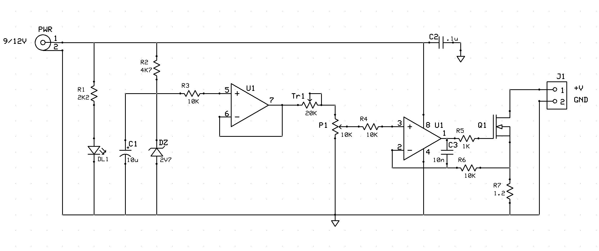

# MOSFET active dummy load for low-power PSU
This is a simple design for an active dummy load, using a MOSFET, to test a low power supply with current ratings up to $1A$.
Trimmer Tr1 can be adjusted to present $1.2V$ on pin 3 of the op-amp, when P1 is full.
The MOSFET must dissipate a power of $(Vpsu - 1.2) * 1A$.

## Specifications

### Hardware
Schematics and PCB layouts are designed with ExpressPCB free CAD software.

#### Schematic:

#### PCB Layout:
