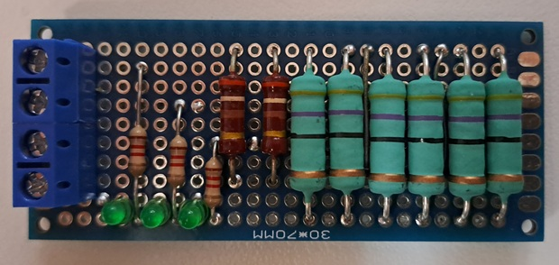
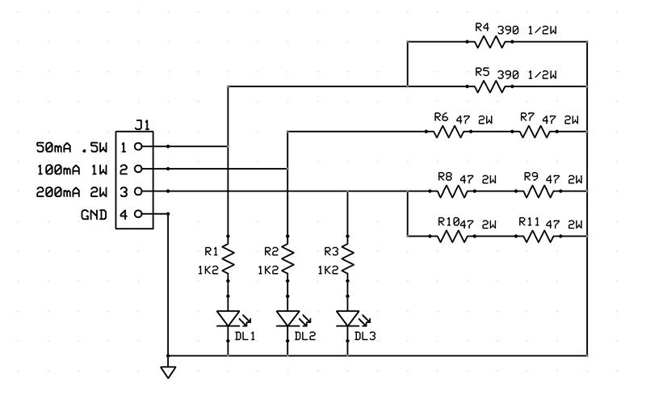
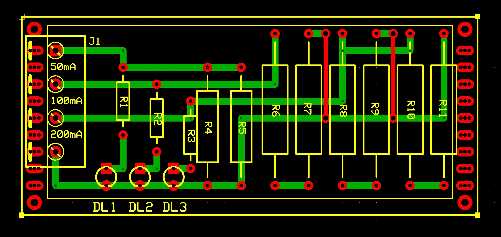

# Resistive dummy load for low-power 9V PSU
This is a simple design for a resistive dummy load to test low power 9V supply at three fixed current values: 50mA, 100mA and 200mA.

## Specifications

### Hardware
Schematics and PCB layouts are designed with ExpressPCB free CAD software.

#### Schematic:

#### PCB Layout:
