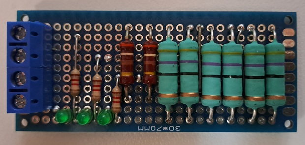
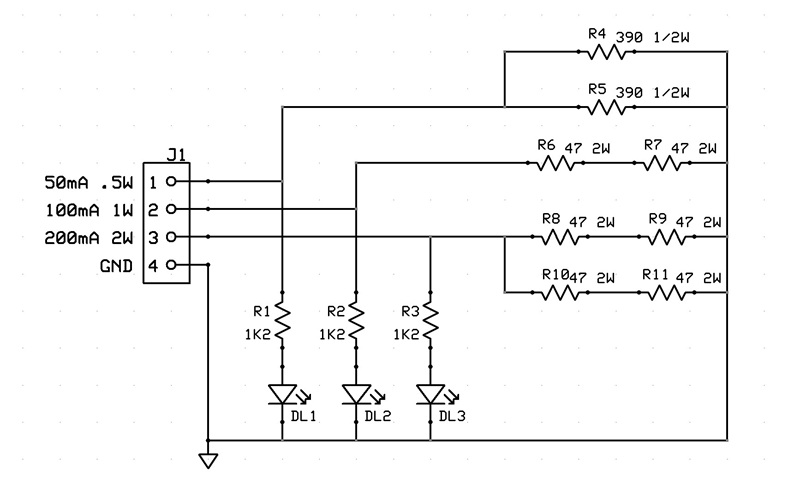
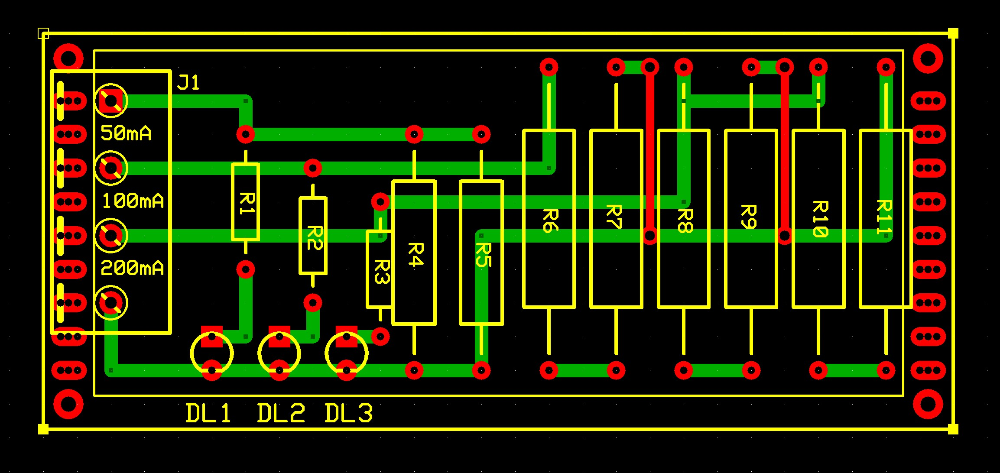

# Resistive dummy load for low-power 9V PSU

## Background and Goal
Design and development of a simple **resistive static load** to test small **$9V$** Power Supply Units (PSUs).

## Requirements
- Input voltage: Fixed $9V$ DC from the PSU under test.
- Selectable test current: $50mA$, $100mA$, and $200mA$. Since the load is purely resistive, current varies proportionally with PSU voltage.
- Design approach: Passive resistive load using common "off-the-shelf" components.
- Philosophy: Keep it Simple.

## Design

#### Schematic

#### Circuit Analysis
The resistor values ($R=V/I$) and power ratings ($P=V^2/R$) are calculated for each target current. A conservative derating factor was applied by selecting resistors with at least twice the calculated power dissipation.

**For $50mA$ target**: 
$R=9V/0.05A=180\Omega$ 
$P=(9V)^2/180\Omega=0.5W$ 
$\implies$ A resistor of at least $1W$ is required.

**For $100mA$ target**: 
$R=9V/0.1A=90\Omega$ 
$P=(9V)^2/90\Omega=0.9W$ 
$\implies$ A resistor of at least $2W$ is required.

**For $200mA$ target**: 
$R=9V/0.2A=45\Omega$ 
$P=(9V)^2/45\Omega=1.8W$ 
$\implies$ A resistor of at least $4W$ is required.

To achieve these values using standard resistors available in the *box*, the following series and parallel combinations are used (this also helps distribute heat dissipation across multiple elements):

$R \approx 180\Omega : 2 \cdot 390\Omega (0.5W)$ in parallel ($ \approx 195\Omega / 46mA$). 
$R \approx 90\Omega : 2 \cdot 47\Omega (2W)$ in series ($ \approx 94\Omega / 95mA$). 
$R \approx 45\Omega : 4 \cdot 47\Omega (2W)$ in a series-parallel network ($ \approx 47\Omega / 191mA$). 

Since the available standard resistors resulted in slightly lower currents than the target values, **indicator LEDs** were integrated into each branch. These LEDs act as auxiliary loads. 
Assuming a forward voltage drop of approximately $2V$ for each *green* LED: 
$I_{led} = (V_{psu} - V_{drop})/R_{led} = (9V-2V)/1200\Omega \approx 6mA$

LEDs slightly compensate the current deficit introduced by standard resistor values, bringing the final currents to $\approx 52mA$, $\approx 101mA$, and $\approx 197mA$, which are reasonably close to the original design targets.

## Implementation and Test
#### PCB Layout
The circuit was assembled on a custom PCB designed with ExpressPCB.

#### Test Log
The circuit was tested using a **GVDA 30V/10A** switching laboratory power supply. Component temperature was measured using a **GVDA GD128** digital multimeter. Tests were conducted in a closed, non-ventilated environment with an ambient temperature of $21^\circ C$.

**Test 1 (Low Load)**: Connecting the $50mA$ branch for 10 minutes. The voltage remained stable at $9.00V$ with a measured current of $53mA$ ($0.477W$). After the test period, the two resistors reached a temperature of $40^\circ C$. At this temperature, the components remained comfortable to the touch, confirming good thermal margins for this load.

**Test 2 (Medium Load)**: Connecting the $100mA$ branch for 10 minutes. The voltage remained stable at $9.00V$ with a measured current of $103mA$ ($0.927W$). After the test period, the two resistors reached a temperature of $52^\circ C$. At this temperature, the components remained comfortable to the touch, confirming good thermal margins for this load as well.

**Test 3 (Full Load)**: Connecting the $200mA$ branch for 10 minutes. The voltage remained stable at $9.00V$ with a measured current of $200mA$ ($1.800W$). After the test period, the four resistors reached a temperature of $62^\circ C$. At this temperature, the components became very hot, but not too hot to touch, confirming good thermal margins as well.

**Test 4 (Stress Test - Combined Load)**: Connecting all branches simultaneously ($50mA + 100mA + 200mA$). The voltage remained stable at $9.00V$ with a measured current of $352mA$ ($3.168W$). After the test period, the temperature of the resistors on the $200mA$ branch reached $77^\circ C$. At this temperature, the components became too hot to touch. This combined mode is recommended for short-term tests only.

***Note on Test 4***: The measured current ($352mA$) is slightly lower than the sum of the individual branches ($356mA$). This small discrepancy ($\approx 1\%$) is attributed to parasitic voltage drops across connection wires and PCB traces.

#### Test Summary
| Load | Resistance | Measured Current | Power | Temp |
|---|---|---|---|---|
| $50mA$ | $195\Omega$ | $53mA$ | $0.48W$ | $40^\circ C$ |
| $100mA$ | $94\Omega$ | $103mA$ | $0.93W$ | $52^\circ C$ |
| $200mA$ | $47\Omega$ | $200mA$ | $1.80W$ | $62^\circ C$ |
| Combined | $27\Omega$ | $352mA$ | $3.17W$ | $77^\circ C$ |

## Conclusions
**Results**: The results confirmed that the circuit is reliable and meets the design specifications. The experience demonstrates that a simple resistive network can provide an effective and low-cost solution for quick PSU validation.
  
**Suggestions**: Combining the branches allows for additional test currents ($150mA$, $250mA$, $300mA$, and $350mA$). However, as shown in Test 4, the thermal density increases significantly.

**Evolutions**: Transitioning from a passive load to an active dummy load for more linear and adjustable current control.

## About & License
**Author**: Alessandro Fraschetti (gom9000). 
**Technical Notes**: The hardware design was supported by **ExpressPCB** and the custom **[expresspcb-goslib](https://github.com/gom9000/expresspcb-goslib)** libraries. 
**License**: This experience is licensed under the [MIT License](LICENSE). 